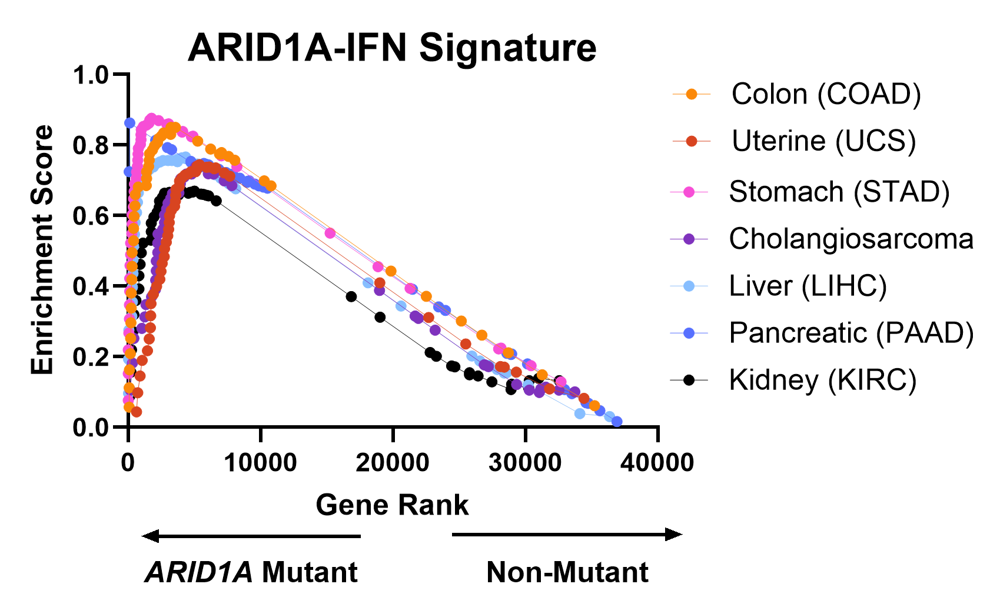

<style>
.tocify {
  font-size: 11pt;
}

.tocify-header .tocify-item {
  font-size: 1.05em;
  padding-left: 25px;
  text-indent: 0;
}

p.caption {
  font-size: 1.25em;
  color: black
}

pre {
  overflow-x: scroll
}

pre code {
  white-space: pre;
}

body {
  font-size: 12pt;
}

</style>


```{r setup, include=FALSE}
#set this as our working directory for all R code chunks in this tutorial.
#IGNORE if you're not using R markdown file
wd <- "/data/mmaxwell/TCGA/GSEA_For_Loop/"
knitr::opts_chunk$set(root.dir = wd)

#Set preference for no warnings to be given when running code chunks in R markdown
#IGNORE if you're not using R markdown file
knitr::opts_chunk$set(warning = FALSE, message = FALSE) 
```

### **TCGA Gene set enrichment analysis of *ARID1A* mutant vs Non-Mutant cancers**
Load packages and set working directory
```{r}
#load packages with package manager package called pacman
if (!require("pacman")) install.packages("pacman")
pacman::p_load(here, 
               maftools, #mutation data
               TCGAutils, #TCGA functions
               TCGAbiolinks, #Pull expression and mutation data
               MultiAssayExperiment, #working with Large RangeSummarized Experiment object
               R.utils, #R utility functions
               dplyr,#data wrangling
               plyr,#data wrangling
               ggplot2,#plotting
               tidyr,#tidy data
               tibble,#tibble objects
               forcats, #factors
               DESeq2, #Differential expression analysis
               BiocFileCache, #cache
               RTCGAToolbox, #TCGA functions
               reshape2,  #data wrangling
               icesTAF,  #make directories in for loop
               stringr,#Reformatting strings
               forcats, #factors
               WebGestaltR) #GSEA

#set working directory
setwd("/data/mmaxwell/TCGA/GSEA_For_Loop/")

```


## **TCGA GSEA of *ARID1A* mutant vs Non-Mutant cancers, for loop**
This code chunk will extract STAR mRNA counts and mutation data from the specified TCGA cohorts using [TCGAbiolinks](https://bioconductor.org/packages/release/bioc/html/TCGAbiolinks.html) package. Analysis of mutation data is performed with [maftools](https://www.bioconductor.org/packages/release/bioc/html/maftools.html) package. Normalized counts for GSEA are generated via [DEseq2](https://bioconductor.org/packages/release/bioc/html/DESeq2.html) and GSEA of *ARID1A* mutant compared to non-mutant cancers is performed using [WebGestaltR](https://cran.r-project.org/web/packages/WebGestaltR/index.html) package. Gene ranks and enrichment scores for interferon gene sets of interest are outputted for each TCGA cohort. 
```{r}

#####function to extract gene ranks and enrichment scores for each gene set
extrac_em_fuc <- function(GeneSetName_index, cohort){
  
  gene_rank <- as.data.frame(gseaRAW$Items_in_Set[GeneSetName_index]) #gene ranks
  gene_rank$Entrez_ID <- rownames(gene_rank)
  es <- as.data.frame(gseaRAW$Running_Sums[(gene_rank$rank), ]) # enrichement scores
  es <- es[, GeneSetName_index]
  print(all(gene_rank$rank == rownames(es))) #TRUE
  geneset_sum <- cbind(gene_rank, es)
  names(geneset_sum) <- c("Rank", "EntrezID", "EnrichmentScore")
  geneset_sum <- geneset_sum[,c(2,1,3)]
  write.table(geneset_sum, paste0(cohort, "_",names(gseaRAW$Items_in_Set)[GeneSetName_index], ".txt"), 
              sep="\t", row.names = F, quote=F) #
}

###
#cohorts <- c("COAD", "CHOL", "LIHC", "PAAD", "STAD", "UCS", "KIRC") #List of cohorts analyzed in paper
cohorts <- c("CHOL", "UCS") #smallest cohorts, run to reduce run time
for (i in 1:length(cohorts)){
  setwd("/data/mmaxwell/TCGA/GSEA_For_Loop/")
  mkdir(paste0("TCGA_", cohorts[i])) # make directory for each cohort, e.g., TCGA_COAD
  setwd(paste0("TCGA_", cohorts[i], "/")) 
  ####download tcga data with TCGAbiolinks
  TCGAbiolinks:::getProjectSummary(paste0("TCGA-", cohorts[i]))
  query_TCGA = GDCquery(
    project = paste0("TCGA-", cohorts[i]),
    data.category = "Transcriptome Profiling",
    data.type = "Gene Expression Quantification",
    workflow.type = "STAR - Counts",
    sample.type = c("Primary Tumor"))
  GDCdownload(query = query_TCGA,)
  invisible(capture.output(
    coda_data <- GDCprepare(query_TCGA)
  ))
  saveRDS(object = coda_data, file = paste0(cohorts[i], "_data.RDS"), compress = FALSE)
  
  #####mutant profile
  query_mut <- GDCquery(
    project = paste0("TCGA-", cohorts[i]), 
    data.category = "Simple Nucleotide Variation", 
    access = "open", 
    #legacy = FALSE, 
    data.type = "Masked Somatic Mutation", 
    workflow.type = "Aliquot Ensemble Somatic Variant Merging and Masking"
  )
  GDCdownload(query_mut)
  coad_mutant <- GDCprepare(query_mut)
  coad_mutant <- coad_mutant %>% read.maf
  saveRDS(coad_mutant, paste0(cohorts[i], "_mutant.RDS"))
  
  mutant_sample <- TCGAbiospec(as.vector(unique(coad_mutant@data$Tumor_Sample_Barcode)))
  mutant_sample <- mutant_sample[mutant_sample$sample_definition=="Primary Solid Tumor",]
  
  #clinical data
  clin <- GDCquery_clinic(paste0("TCGA-", cohorts[i]), "clinical") 
  saveRDS(clin, paste0(cohorts[i], "_clic.RDS")) 
  
  #extract ARID1A mutant samples; define ARID1A+ as samples with mutations in ARID1A
  ARID1A_maf <- subsetMaf(maf=coad_mutant, genes = "ARID1A", mafObj = T) 
  ARID1A_pos_barcode <- as.vector(getSampleSummary(ARID1A_maf)$Tumor_Sample_Barcode)
  ARID1A_pos_sample <- TCGAbiospec(ARID1A_pos_barcode)
  
  #ARID1A non-mutant samples (samples without ARID1A mutations)
  tsb_select <- coad_mutant@data$Tumor_Sample_Barcode[!coad_mutant@data$Tumor_Sample_Barcode %in% ARID1A_maf@data$Tumor_Sample_Barcode]
  ARID1A_neg_maf <- subsetMaf(maf=coad_mutant, tsb = tsb_select, mafObj = T) #581 samples
  ARID1A_neg_barcode <- as.vector(getSampleSummary(ARID1A_neg_maf)$Tumor_Sample_Barcode)
  ARID1A_neg_sample <- TCGAbiospec(ARID1A_neg_barcode)
  
  #######perform DE analysis for mutant and non-mutant tumor samples
  #download raw count data with TCGAbiolinks
  
  # For a few cohorts, there are overlaps between the names of mutant and non-mutant samples.
  # It will cause errors when combining them in the next step. So we need to check the samples and edit manually.
  if (cohorts[i]=="KIRC") { ARID1A_neg_sample <- ARID1A_neg_sample[-349,] }
  if (cohorts[i]=="UCEC") { ARID1A_neg_sample <- ARID1A_neg_sample[-49,] }
  #
  
  mutant_sample <- colData(coda_data)$barcode[colData(coda_data)$sample_submitter_id %in% paste0(ARID1A_pos_sample$submitter_id, "-01A")] #31
  nonMutant_sample <- colData(coda_data)$barcode[colData(coda_data)$sample_submitter_id %in% paste0(ARID1A_neg_sample$submitter_id, "-01A")]#481
  mutant_sample<-colData(coda_data)$barcode[colData(coda_data)$barcode %in% c(mutant_sample)]
  nonMutant_sample<-colData(coda_data)$barcode[colData(coda_data)$barcode %in% c(nonMutant_sample)]
  print(intersect(mutant_sample,nonMutant_sample) ) # should be no overlap
  
  dat1 <- subset(coda_data, select=colData(coda_data)$barcode %in% c(mutant_sample))
  dat1 <- assay(dat1, "unstranded")
  dat2 <- subset(coda_data, select=colData(coda_data)$barcode %in% c(nonMutant_sample))
  dat2 <- assay(dat2, "unstranded")
  coda_expr_raw <- cbind(dat1, dat2) 
  saveRDS(object = coda_expr_raw, file = paste0(cohorts[i], "_raw.RDS"), compress = FALSE)
  
  # DEseq2
  set.seed(12345)
  outdir <- getwd()
  raw.count <- coda_expr_raw
  sample <- data.frame(ARID1A=c(rep("mutant", length(mutant_sample)), rep("non-mutant", length(nonMutant_sample))),
                       row.names=colnames(raw.count))
  sample$sample <- rownames(sample)
  DESeq.dat <- DESeqDataSetFromMatrix(countData = (raw.count),
                                      colData = sample,
                                      design = ~ ARID1A)
  DESeq.dat <- DESeq.dat[rowSums(counts(DESeq.dat)) >= 0,] #remove genes without any expression in all samples 
  DESeq.dat$ARID1A <- factor(DESeq.dat$ARID1A, levels = c("non-mutant", "mutant"))
  DESeq.dat <- DESeq(DESeq.dat)
  res <- results(DESeq.dat, name = resultsNames(DESeq.dat)[2], alpha = 0.05)
  resOrdered <- res[order(res$padj),]
  resOrdered$ensembl_gene_id <- rownames(resOrdered)
  geneAnnotation <- as.data.frame(rowData(coda_data)[,c("gene_id", "gene_name")])
  names(geneAnnotation)[1] <- "ensembl_gene_id"
  resOrdered <- merge(geneAnnotation, as.data.frame(resOrdered[, c("log2FoldChange", "pvalue", "padj", "ensembl_gene_id")]), by="ensembl_gene_id")
  write.table(resOrdered, "DEouput_all.txt", quote=F, sep="\t", row.names = F)
  fdr=0.05
  FC=1.5
  DEgene_up <- resOrdered[row.names(subset(resOrdered, padj < fdr & log2FoldChange > log2(FC))),]
  DEgene_down <- resOrdered[row.names(subset(resOrdered, padj < fdr & log2FoldChange < -log2(FC))),]
  message(paste0("#up=", nrow(DEgene_up), " #down=", nrow(DEgene_down)))
  write.table(DEgene_up, file=paste0(cohorts[i], "_Pval", fdr, "_FC", FC, "_up.txt"), quote=F, row.names = F, sep="\t")
  write.table(DEgene_down, file=paste0(cohorts[i], "_Pval", fdr, "_FC", FC, "_down.txt"), quote=F, row.names = F, sep="\t")
  # GSEA input and run online: create rank gene list for gsea
  rank.score <- -log10(resOrdered$padj)*sign(resOrdered$log2FoldChange)
  rank.score[is.na(rank.score)] <- 0
  rank.score[rank.score == Inf] <- max(rank.score[which(rank.score < Inf)])+50
  rank.score[rank.score == -Inf] <- min(rank.score[which(rank.score > -Inf)])-50
  rankGene <- data.frame(GeneID=resOrdered$gene_name, rankScore=rank.score)
  write.table(rankGene, "gsea_input.rnk", quote=F, row.names = F, sep = "\t")
  
  #
  set.seed(12345) # set seed when running enrichment analysis and plotting to make sure results can be replicated each time.
  runEnrich <- function(rankGenelist) {
    enrichTestGSEA <- WebGestaltR(enrichMethod = "GSEA",
                                  organism="hsapiens", 
                                  enrichDatabaseFile="../h.all.v7.1.symbols_add_ARID1A_IFN_Sig.gmt", #Keep gmt file in base working directory!
                                  enrichDatabaseType="genesymbol",
                                  interestGene = rankGenelist,
                                  interestGeneType = "genesymbol",
                                  referenceSet="genome",
                                  minNum=5,maxNum=2000,
                                  perNum=1000,
                                  fdrMethod="BH", sigMethod="top", topThr = 51, reportNum = 51,
                                  isOutput=T,
                                  outputDirectory="./",
                                  projectName=paste0(cohorts[i],"_GSEA_hallmark"),
                                  saveRawGseaResult=T,
                                  nThreads=12)
  }
  runEnrich(rankGenelist=rankGene)
  #end.
  
  #extract gene ranks and enrichment scores for each gene set
  gseaRAW <- readRDS(paste0("Project_", cohorts[i],"_GSEA_hallmark/", "Project_", cohorts[i],"_GSEA_hallmark_GSEA/rawGseaResult.rds")) # gsea outputs
  # names(gseaRAW$Items_in_Set) #A list with ranks of genes for each gene set
  # head(gseaRAW$Running_Sums)   #A matrix of running sum of scores for each gene set
  # # check the gene set index; set GeneSetName_index
  # names(gseaRAW$Items_in_Set)[38] 
  # GeneSetName_index is 38 for ARID1A_ISG_Signatures 
  extrac_em_fuc(GeneSetName_index=38, paste0("TCGA_", cohorts[i]))
  #GeneSetName_index=36 for HALLMARK_INTERFERON_ALPHA_RESPONSE 
  #names(gseaRAW$Items_in_Set)[36]
  extrac_em_fuc(GeneSetName_index=36, paste0("TCGA_", cohorts[i]))
  #GeneSetName_index=36 for HALLMARK_INTERFERON_GAMMA_RESPONSE 
  #names(gseaRAW$Items_in_Set)[10]
  extrac_em_fuc(GeneSetName_index=10, paste0("TCGA_", cohorts[i]))
  #end.
  
} 

```


## **Cholangiosarcoma GSEA barplot**
Example results from TCGA analysis in cholangiosarcoma showing significant enrichment of the ARID1A-IFN signature in *ARID1A* mutant compared to non-mutant.
```{r}

rawGseaResult <- readRDS("./TCGA_CHOL/Project_CHOL_GSEA_hallmark/Project_CHOL_GSEA_hallmark_GSEA/rawGseaResult.rds")


Gene_set <- names(rawGseaResult$Items_in_Set)
#replace underscores with spaces
Gene_set <- gsub("_", " ", Gene_set) 
#Capitalize only first letter of each word, stringr package
Gene_set <- str_to_title(Gene_set)
#delete hallmark text, too reduant for later plotting
Gene_set <- gsub("Hallmark ", "", Gene_set)

NES <- rawGseaResult$Enrichment_Results$NES
FDR <- rawGseaResult$Enrichment_Results$fdr

#make gsea_df for plotting
gsea_df <- data.frame(Gene_set, NES, FDR)

#Take top and bottom 4 gene sets, dplyr package
top5 <- gsea_df %>% 
  arrange(NES) %>%
  slice_head(n=5)
bottom5 <- gsea_df %>%
  arrange(NES) %>%
  slice_tail(n=5)

#join the top enrichments for sgArid1a and sgScr C2 T cells
top_df <- rbind(top5, bottom5)

#GSEA vertical bars (log10pvalue scale, y=gene set, x=NES) #ggplot2 and forcats packages
ggplot(top_df, aes(NES, fct_reorder(Gene_set, NES), fill=FDR)) + geom_col() + 
         scale_fill_gradientn(colors=c("#8b0000","#FEFEBE","#9FE2BF","slateblue"))+theme_classic()+theme(panel.border = element_rect(color="black",fill=NA,size=1.5))+ggtitle("GSEA")+labs(fill="FDR")+geom_vline(xintercept = c(0),size=1) +
  theme(axis.title.y = element_blank(),
        axis.title.x = element_text(size = 14),
        plot.title = element_text(size = 18, face = "bold")) +
  labs(title = "Cholangiosarcoma \nGSEA", 
       x = "NES \n(ARID1A mutant/Non-Mutant)") 

```


## **ARID1A-IFN Signature GSEA Curves (Figure 3E)**
TCGA GSEA curves in Maxwell et al were made with gene ranks and enrichment scores from the code above. The results were plotted in an XY plot in GraphPad Prism. Below is an example of the figures we made using this analysis. 
```{r echo=FALSE, out.width = "100%", fig.align = "center"}

```

## **Session Info**
For reproducibility, my session info is listed below outlining the version of R and package versions that I’ve using for this vignette. 
```{r}
print(sessionInfo())
```
